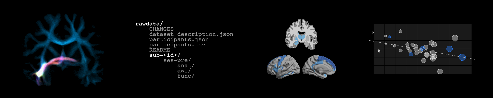

# MRI analytic tools  
Set of various tools for ordering and processing MRI data!  
Also check my code for some basic [R plots](https://github.com/rcruces/R-graph).  

  

## Table of Contents  
1. [DICOM to BIDS](#dicom-to-bids)
1. [DWI pre-Processing](#dwi-pre-processing)
1. [Vector Correction for DWI data](#vector-correction-for-dwi-data)
1. [Freesurfer pre-processing](#freesurfer-preprocessing)
1. [Connectome Prediction Modeling CPM](#connectome-prediction-modeling-cpm)
1. [rois_volume.R](#`rois_volume.R`)

# [DICOM to BIDS](https://github.com/rcruces/MRI_analytic_tools/tree/master/DICOM to BIDS)  
Example script to order a set of sorted DICOMS into BIDS (https://bids.neuroimaging.io).  
> Gorgolewski, Krzysztof J., et al. "The brain imaging data structure, a format for organizing and describing outputs of neuroimaging experiments." Scientific data 3.1 (2016): 1-9. DOI: https://doi.org/10.1038/sdata.2016.44.  

# [DWI pre-Processing](https://github.com/rcruces/MRI_analytic_tools/tree/master/DWI_preprocessing)  
Pipeline for preprocessing Diffusion Weighted Images (DWI). I makes vector correction, denoise, bias field correction, motion and geometric distortion correction. It uses multiple tools such as: ants, fsl, mrtrix...  

# [Vector Correction for DWI data](https://github.com/rcruces/MRI_analytic_tools/tree/master/vector_corr)
**`vector_corr`** is a handy script to undestand the steps for correcting the diffusion vectors (bvecs) when the acquisition matrix is angled.    
This requires and updated version or **[mrtrix](http://www.mrtrix.org/)**, the transformation matrix from the acquisition of the DWI (omat), bvecs and bvals in column format, and the text file of corrected.eddy parameters obtained after topup/eddy from FSL.  
- Check the code in the directory [/vector_corr](https://github.com/rcruces/MRI_analytic_tools/tree/master/vector_corr)  
>*Reference:* Leemans, A., & Jones, D. K. (2009). The B‐matrix must be rotated when correcting for subject motion in DTI data. Magnetic resonance in medicine, 61(6), 1336-1349.  

# [FreeSurfer Preprocessing](https://github.com/rcruces/MRI_analytic_tools/tree/master/Freesurfer_preprocessing)  
A practical guideline for preprocessing T1 weighted images with FreeSurfer. For further information and details check the official webpage [here](https://surfer.nmr.mgh.harvard.edu/).  
- This guideline requires the previous installation of [Advance Normalization Tools](https://stnava.github.io/ANTs/) (ANTs), [FreeSurfer](https://surfer.nmr.mgh.harvard.edu/fswiki/DownloadAndInstall), and [minc-toolkit](https://github.com/BIC-MNI/minc-toolkit).  
- You can find the tutorial in [/Freesurfer_preprocessing](https://github.com/rcruces/MRI_analytic_tools/tree/master/Freesurfer_preprocessing).

# [Connectome Prediction Modeling CPM](https://github.com/rcruces/MRI_analytic_tools/tree/master/R_connectome_prediction_modelling)
This is the **R implementation** (originally in matlab) of a connectome-based predictive modelling to predict individual behaviour from brain connectivity as described by [Shen et al.](https://www.nature.com/articles/nprot.2016.178).  
The original code in matlab can be found in this [link](https://www.nitrc.org/frs/?group_id=51).  
I used this method with real structural data and a behavioural variable without succes, so included an ideal example of how this method would work if you have a strong linear relations between the connectomes *Wij* and a cognitive feature.  
- All data an a matlab script for validation of the R implementation can be found here: [/R_connectome_prediction_modelling](https://github.com/rcruces/MRI_analytic_tools/tree/master/R_connectome_prediction_modelling)   
> Reference: *SHEN, Xilin, et al. Using connectome-based predictive modeling to predict individual behavior from brain connectivity. nature protocols, 2017, vol. 12, no 3, p. 506-518.*.  

# [`rois_volume.R`](https://github.com/rcruces/MRI_analytic_tools/blob/master/rois_volume.R)  
R script with a function that counts the number of voxels per ROI of a NIFTI file. For example a segmentation. It uses the R package [`oro.nifti`](https://www.rdocumentation.org/packages/oro.nifti/versions/0.7.2).
